### Install Qt Creator

Since I am using the Windows operating system, I decided to install Qt Creator on my Windows system, as depicted below.

As of October 5, 2023, I am running Qt Creator version 11.0.2 (community).

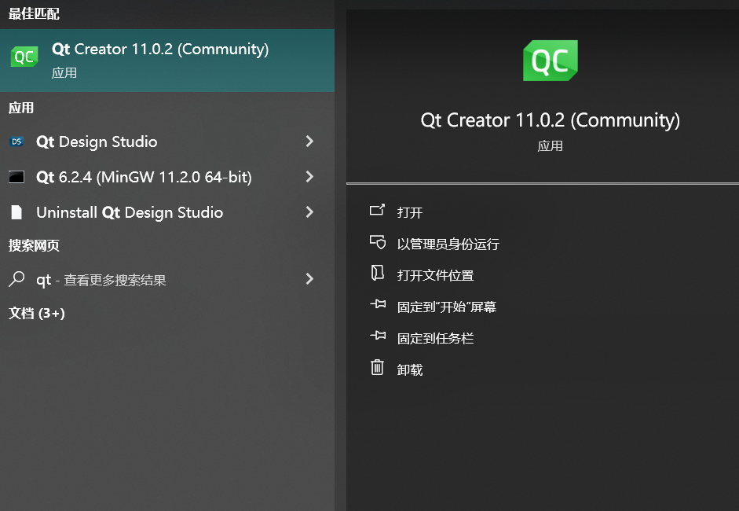

Unzip the test file and open it in Qt Creator. It will need to be configured initially, which may take a moment.

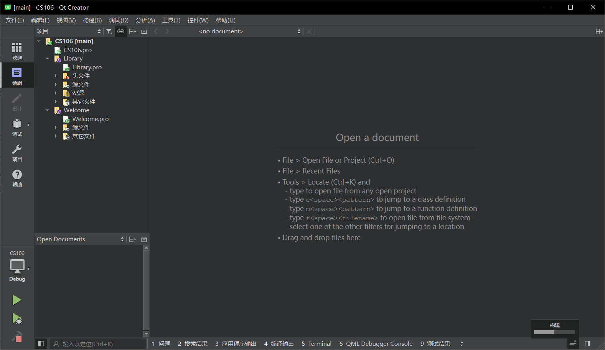

If everything has proceeded smoothly, click the green right arrow button. A dialog box will appear, displaying copyright information and requesting that you enter your name or nickname. After entering your name or any other text, it will generate an image as illustrated below.

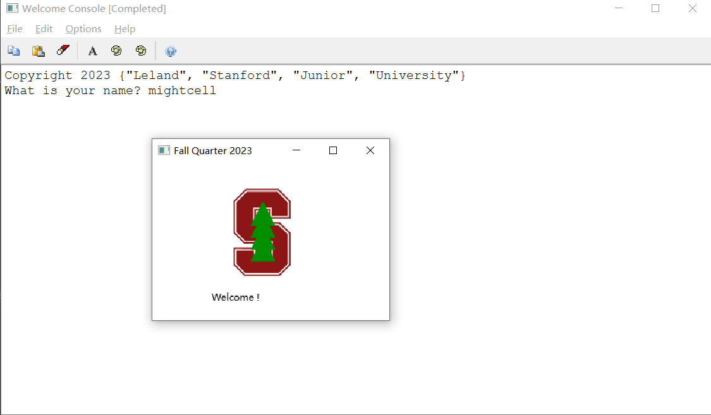

#### Recommended Settings for Qt Creator

These settings are recommended by the officials's documentation, as depicted below.

##### Build & Run pane

1. General

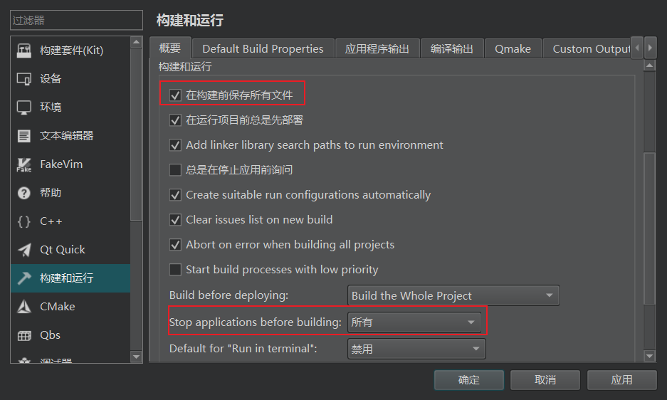

1. Compile Output

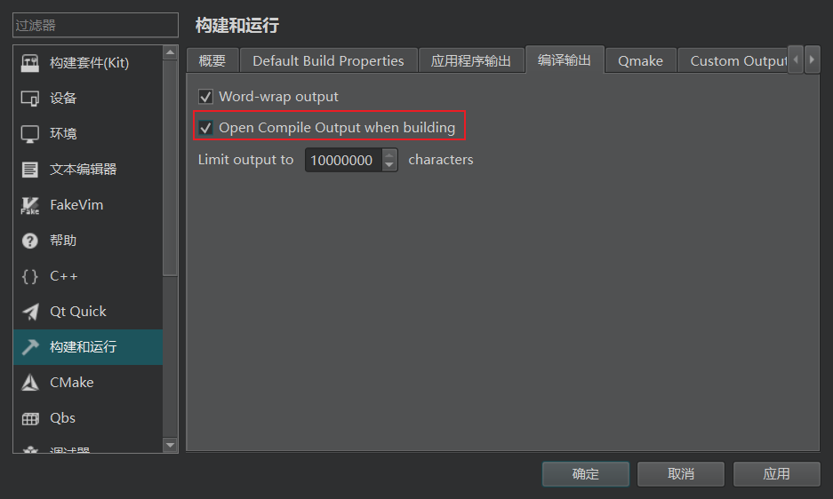

1. Application Output

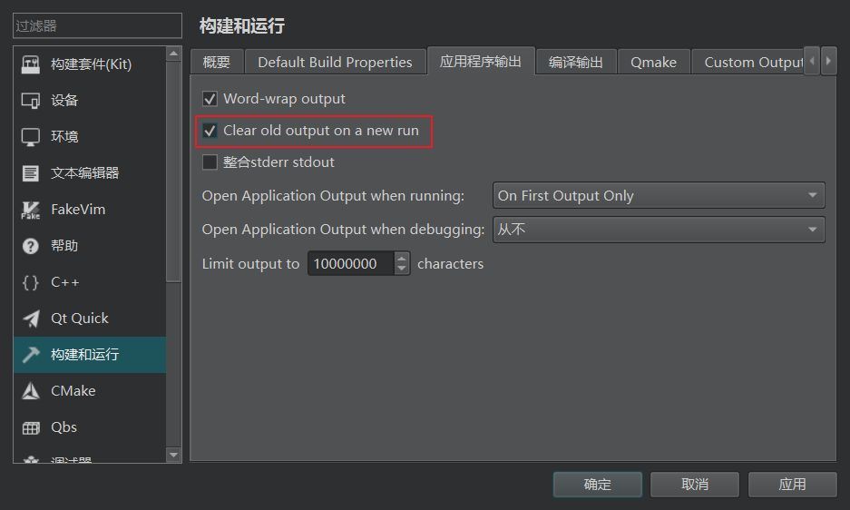

##### Debug pane

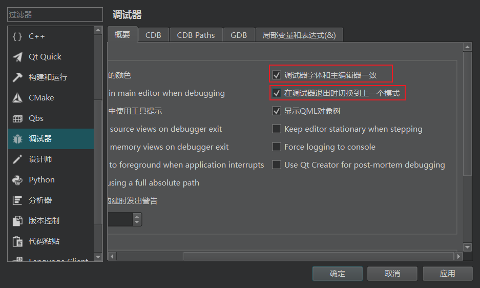

##### Disable style analyzer

Qt Creator utilizes a code analyzer to ensure adherence to industry-standard "best practices", but disabling this feature may be more suitable for our needs. We must adjust the settings in both the Analyzer and C++ sections.

###### Analyzer pane

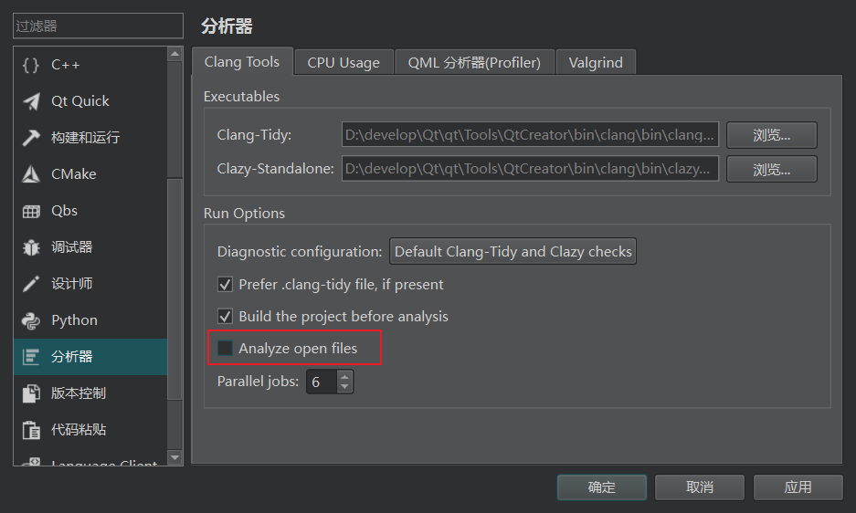

###### C++ pane

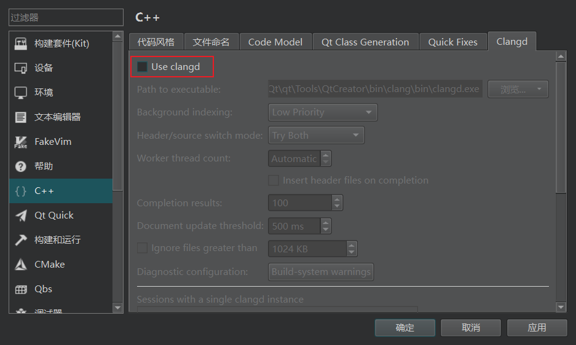

Don't forget to click OK to save your settings.

### Configuring the Qt debugging helper

The helper has already been installed when we configure the test file automatically. If it doesn't work, we have to manually activate it. We can use a program to determine whether our Qt Creator is configured for the custom debugging helper. Fortunately, my Qt Creator works.

### Hash your name

Unzip the assignment code and open it in Qt Creator, as illustrated below.

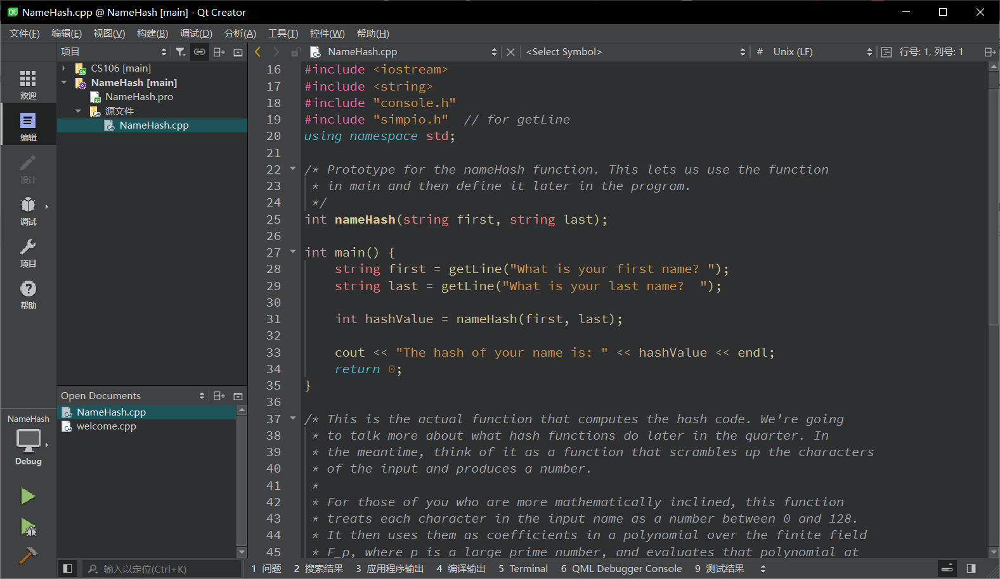

The debugger is a tool we can employ to gain insights into our program's behavior while it is running. The`nameHash`function, which serves as the core function in NameHash.cpp, calculates the hash code by assigning a numerical value to each character in the input name, ranging from 0 to 128. For this course, we are not required to delve into the mathematical principles behind the process.

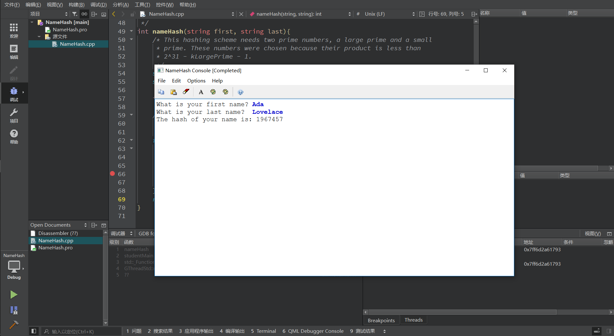

The special value is 1967457.