## Part One: Stack Overflow

### Step One: See a Stack Overflow

Run the provided starter files without the debugger engaged.

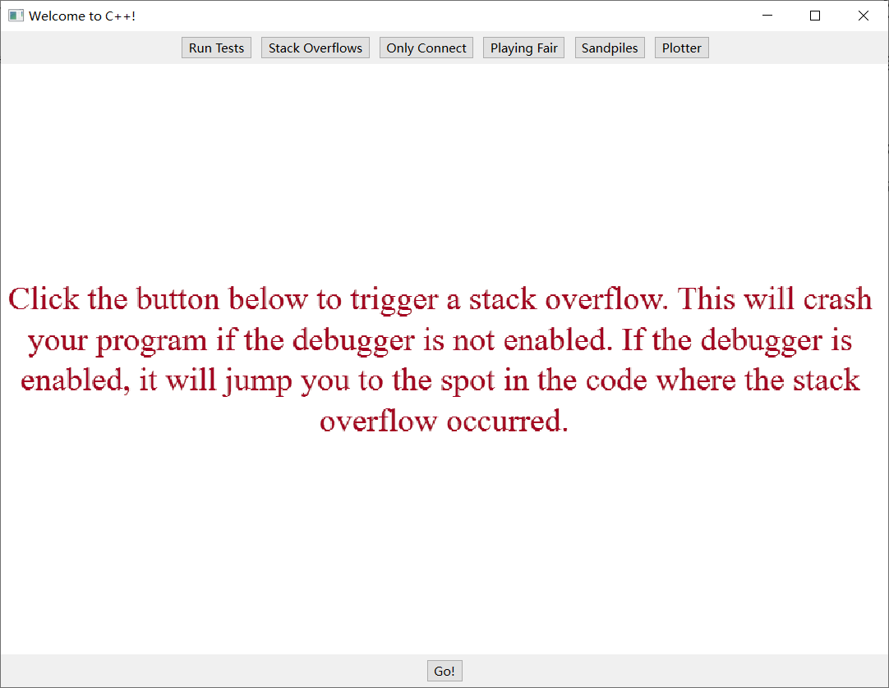

Q1: What do you see when you trigger a stack overflow when running the program without the debugger enabled? Write your answer below.

A1: The program interface briefly froze when I clicked the "go" button on the Stack Overflow window, and it was subsequently forcefully terminated.

### Step Two: Trace a Stack Overflow

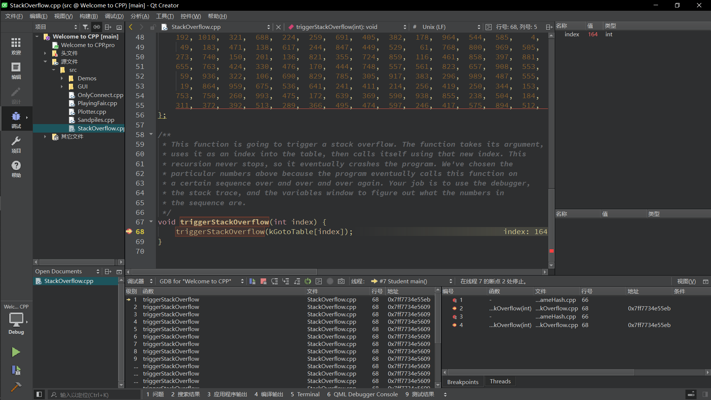

Q2: What is the sequence of values that repeats in the stack overflow? Write your answer below.

A2: 137, 164, 685, 203, 327, 549, 137

## Part Two: Only Connect

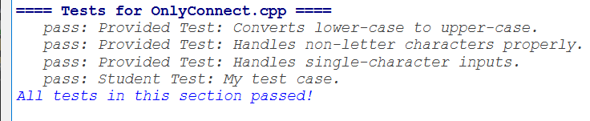

- Implement the`onlyConnectize`function in`onlyConnect.cpp`, which must be implemented recursively.

- - Input: a string
  - Output: a string which is in upper case with all characters that aren't consonants, including spaces, numbers, digits, etc.

- `toUpperCase`["strlib.h"]

- - Convert a single character to upper case. It takes in a char, then returns the upper-case version of that letter.
  - If you call the function on a non-letter character like '$' or '#', it will return the original character unmodified.

- `isalpha`[<cctype>]

- - It takes in a char and returns whether it is a letter.

- `charToString`["strlib.h"]

- - Convert a char to a string.

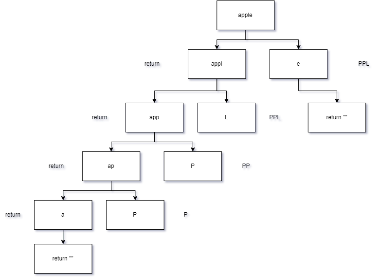

When dealing with recursion, it is crucial to consider the base case first. In our scenario, the base case occurs when the input string is empty. In this case, we can immediately return an empty string, which marks the termination point of our recursion.

Next, let's address the normal scenario. Our goal is to remove non-letter and vowel characters and then convert the remaining non-vowel letters to uppercase. We should break down the phrase into smaller segments until it becomes empty, following the principles of recursion, which align with our first critical condition.

So, how do we split and reduce the phrase? My proposed solution is to divide the phrase into two parts: the last character and the rest of the phrase. By removing the last character, we can make the problem smaller. It's essential to record the last character since it will be a non-vowel letter. Here, we encounter two possible critical conditions:

1. If the last character is a non-letter or a vowel character, there's no need to concatenate it back to the phrase. Instead, we pass the modified phrase into the recursion.
2. If the last character is a non-vowel letter, we convert it to uppercase and then append it back to the phrase. We then pass the updated phrase, including the last character, into the recursion.

## Part Three: Playing Fair

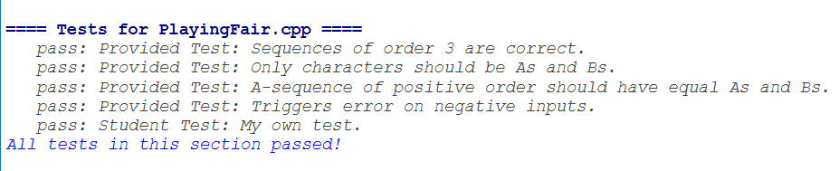

Finding the solution for part three becomes more straightforward by building upon the practice from the previous requirements. We can create a recursive diagram to visualize this demand.

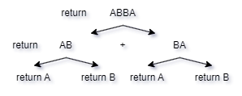

The fundamental condition for this question is the 0th order sequence, which essentially returns either an 'A' or 'B' character. When we examine the 1st order sequence, it becomes evident that it is formed by two 0th order sequences, with the key distinction being their arrangement—whether one is in the front or after the other.

Once everything works, click the button in the demo program to see a cool visualization of the sequences you've generated.

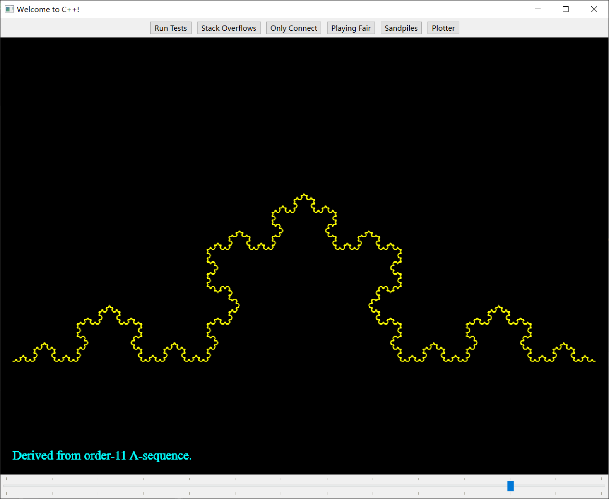

## Part Four: Sandpiles

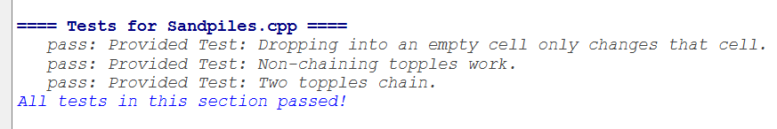

Whether the order is ascending or descending, the specific direction of the order is not crucial and requires complex mathematical proof. Nonetheless, our focus should be on identifying the termination condition. When the sand is outside the grid, no further action is necessary, making it a valid condition.

Secondly, when we count the number of sand particles within the grid, we can increment this count. If the count in the grid reaches four, we should first empty the grid.

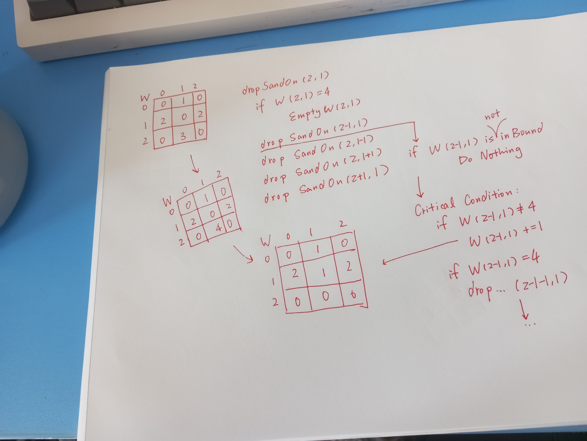

I made a mistake when writing the recursive function. Instead of invoking the function, I accidentally returned the function itself, causing the function to execute only once.

We can also visualize the effect of Sandpiles.

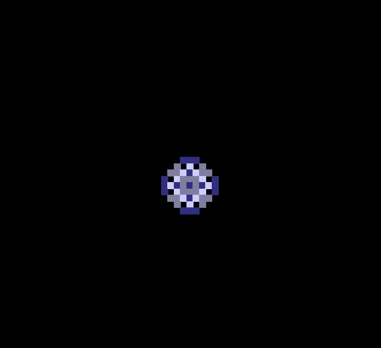

## Part Five: Plotter

The essence of this requirement is to meticulously follow the documentation's instructions, step by step, for each task. It is advisable to debug using our own plotting script for convenience.

This is the graph shown below, and it is udeniably impressive!😎

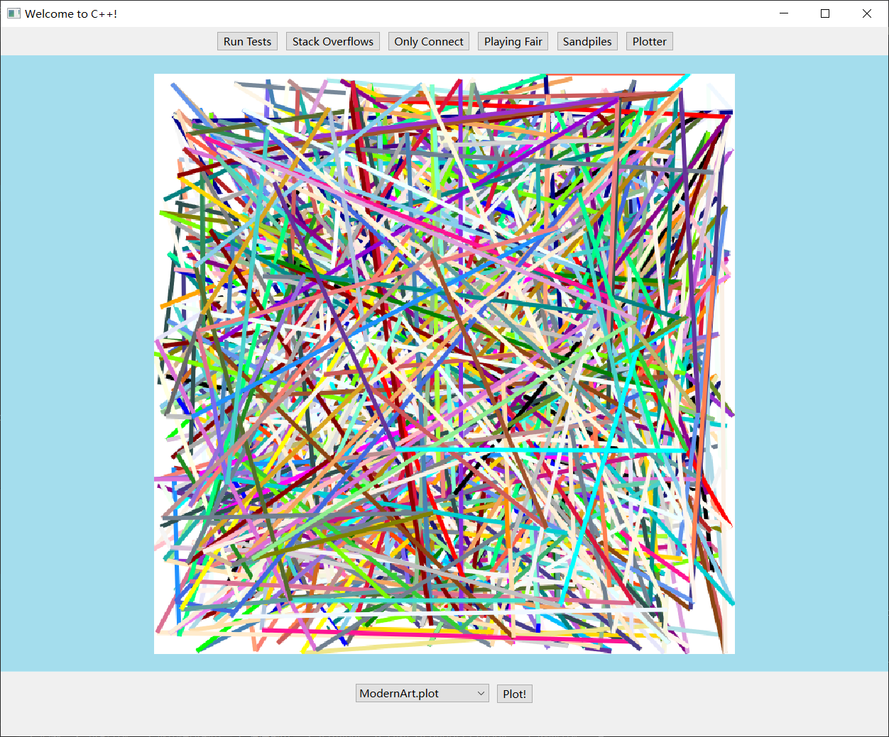