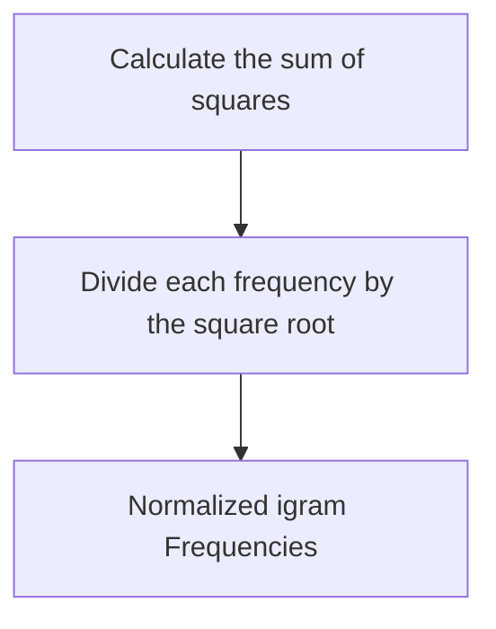

## Assignment 2

### Rosetta Stone

This section involves determining the language of text context, and the official documentation provides comprehensive guidance. Just follow the documented steps for implementation.


#### Form k-Grams

This function calculates the frequency of the k-gram in the text. This requirement primarily helps us become familiar with various collection types and their application scenarios on a personal level.

In this function, the critical operation is searching, enabling the Map to swiftly find the value associated with a specific key. To achieve this, it's essential to split the text based on the kGramLength. I initially employed a quick and slow pointer approach for splitting, but ultimately, I found a **substr** function in the Stanford standard library, which simplified the process.

#### Normalize Frequencies


To normalize gram frequencies across texts of different lengths, we can use the following mathematical model:
Let $f_i$ be the frequency of the gram $T_i$ in a text, and $N$ be the total number of distinct grams in the text. 

First, calculate the sum of the squares of all gram frequencies:
$$
\begin{equation}
S = \sum_{i=1}^{N} f_i^2
\end{equation}
$$
Then, normalize each gram frequency by dividing it by the square root of the sum of squares:
$$
\begin{equation}
\text{Normalized Frequency of } T_i = \frac{f_i}{\sqrt{S}}
\end{equation}
$$
This normalization process ensures that gram frequencies are consistent across texts of different lengths.
```c++
double sum = 0;
for (string key : input) {
    sum += pow(input[key], 2);
}
sum = sqrt(sum);
for (string key : input) {
    result.put(key, input.get(key) / sum);
}
```

#### Filter Out Uncommon Trigrams

In this section, we need to filter out less frequently occurring grams and retrieve a specified number of the most frequent ones. The official documentation recommends using a priority queue for this implementation. In a priority queue, elements are sorted based on their weights, where smaller numbers represent higher priority by default. 

```c++
PriorityQueue<string> queue;
for (string key : source) {
    queue.enqueue(key, INT_MAX - source.get(key));
}
```

However, for our case, larger numbers indicate higher importance in terms of frequency. This means that frequency is a measure of high significance. To handle this, when inserting elements into the priority queue and setting their weights, we need to transform this measure of high significance into a priority value. One common approach is to subtract the current frequency from a maximum value plus one. However, finding the maximum value would add additional time complexity. Therefore, we directly use the integer upper limit as the maximum value for this transformation.

#### Implement Cosine Similarity

This part is not very challenging; we can straightforwardly implement the formula for cosine similarity.

#### Guess a Text's language

This requirement, once all the aforementioned functions are completed, can be invoked logically.

#### Explore and Evaluate

After completing the implementation, click the "Run" button. The program will begin by loading a series of corpora. Once the loading process is finished, you can input the specific language you wish the program to predict into the text box.

