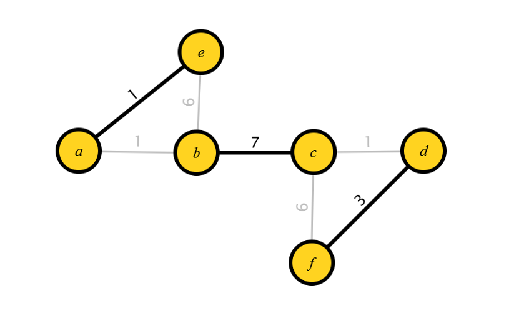
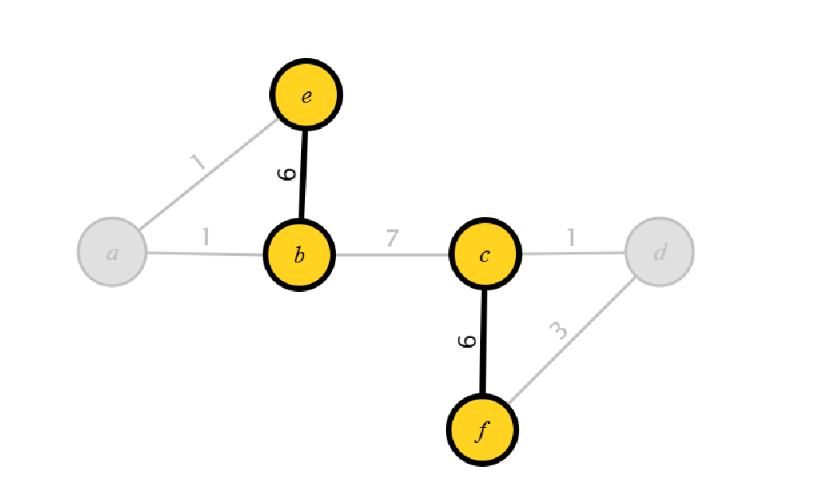
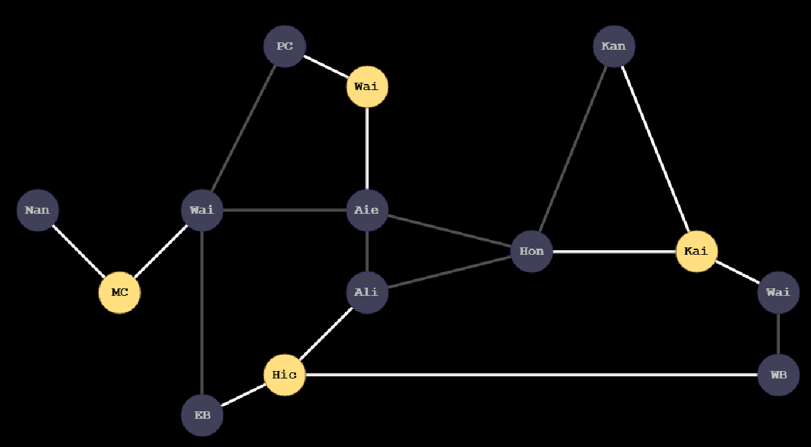

- [x] Part One: Debugging Practice

- [x] Part Two: Matchmaker
  - [x] Milestone One: Find Perfect Matching

  

  - [x] Milestone Two: Find Maximum-Weight Matchings

  

- [x] Part Three: Disaster Planning

  